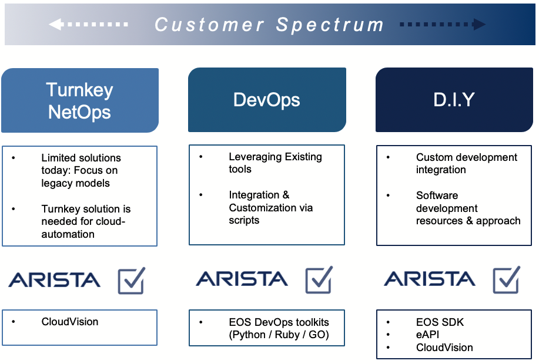

  

# Arista Netdevops Examples

## About

This repository is a central place where Arista demos and examples around netdevops methodology.

    

## Available content

### Demo Content

- [__Arista Validated Design__](ansible/avd-evpn-l3ls-1/): Generate EOS EVPN/VXLAN Fabric deployed using CloudVision and with pre/post deployment tests.
- [__Zero Touch Provisioning to EVPN Fabric__](ansible/ztp-avd-cvp): Build a complete EVPN/VXLAN fabric using CloudVision and Zero Touch Provisioning process.
- [__Ansible AVD & CVP Transfer of Information__](ansible/avd-cvp-toi): Content to build a Transfer of Information on Arista Validated Design and Cloudvision collection.
- [__Ansible to sync configlets across CV servers__](ansible/ansible-sync-configlets): Content to synchronize configlets from one CV server to another. Complete documenation is available on our [EOS Central Knowledge base](https://eos.arista.com/synchronising-cloudvision-portal-configlets-with-ansible/)

### Webinar & Presentation content

- [__Network Field Days 22__](demo/ansible-batfish-cv-nfd22/): Ansible & Batfish ([NFD22 webpage](https://techfieldday.com/appearance/arista-networks-presents-at-networking-field-day-22/))
- [__Tech Friday March 2020__](demo/tech-friday-march2020/): Lab used during Tech Friday event.
- [__Network Automation with Ansible & Cloudvision - EMEA Webinar April 2020__](demo/emea-2020-ansible-cvp-automation): Build an EVPN/VXLAN Fabric using Ansible & Cloudvision with pot deployment validation using WARD
- [__Network Field Days 22__](demo/ansible-batfish-cv-nfd22/): Ansible & Batfish ([NFD22 webpage](https://techfieldday.com/appearance/arista-networks-presents-at-networking-field-day-22/)).

## License

All examples and demos available in this repository are provided under [Apache License](LICENSE)

# Ask question or report issue

Please open an issue on Github this is the fastest way to get an answer.

# Contribute

Contributing pull requests are gladly welcomed for this repository. If you are planning a big change, please start a discussion first to make sure we’ll be able to merge it.
