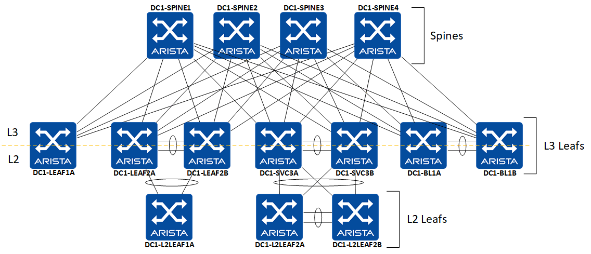

    

__WARNING:__ Ansible Validated Design demo. Work in Progress.

<!-- @import "[TOC]" {cmd="toc" depthFrom=1 depthTo=6 orderedList=false} -->

<!-- code_chunk_output -->

- [Ansible Arista Validated Design](#ansible-arista-validated-design)
  - [Lab Topology](#lab-topology)
  - [Quick Start](#quick-start)
  - [Requirements](#requirements)
  - [Step by Step demo](#step-by-step-demo)
  - [Resources](#resources)
- [License](#license)
- [Ask question or report issue](#ask-question-or-report-issue)
- [Contribute](#contribute)

<!-- /code_chunk_output -->

# Ansible Arista Validated Design

Repository provides modules and roles to build an EVPN/VXLAN fabric using Ansible to build and deploy configuration to devices.

Devices configuration are based on [Arista EVPN Design Guide](https://www.arista.com/en/solutions/design-guides) and cover a generic Unified Cloud Network environment.


## Lab Topology

The Lab topology consists of four spines, seven L3 leafs and and three L2 Leafs, deployed on vEOS-LAB.



## Quick Start

```shell
# Configure Python virtual environment
$ virtualenv -p $(which python) .venv
$ source .venv/bin/activate

# Install Python requirements
$ pip install -r requirements.txt

# Install arista collections
$ ansible-galaxy collection install arista.avd
$ ansible-galaxy collection install arista.cvp

# Install batfish role from galaxy
$ ansible-galaxy install batfish.base

# Start batfish server
$ docker run --name batfish -v batfish-data:/data \
  -p 8888:8888 -p 9997:9997 -p 9996:9996 batfish/allinone

# Edit Inventory file
$ vim inventory.yml

# Edit fabric variables
# Change values to point to your own information
$ vim group_vars/DC1_FABRIC.yml

# Run ansible playbooks
$ cd examples/evpn-design-guide/
$ ansible-playbook dc1-fabric-config.yml --tags "build"
```

## Requirements

- Python: `3.x`
- [Ansible](https://www.ansible.com/): `2.9`
- [Arista Validated Design Collection](https://galaxy.ansible.com/arista/avd): `v1.0.0`
- [Arista CloudVision Collection](https://galaxy.ansible.com/arista/cvp): `v1.0.4`
- [Batfish](https://github.com/batfish/batfish) & [PyBatfish](https://github.com/batfish/pybatfish): `0.36.0`
- [Pytest](https://docs.pytest.org/en/latest/): `5.3.4`
- [Ward](https://wardpy.com/): `0.34.0b0`
- Docker to run Batfish server

## Step by Step demo

__1. Generate EOS configuration and CloudVision parameters__

This step generate following elements:

- [EOS Structure configuration](intended/structured_configs/)
- [EOS Configuration files](intended/configs/)
- [Fabric documentation](documentation/)

```shell
$ ansible-playbook dc-fabric-deploy-cvp.yml --tags build
PLAY [Build Switch configuration]
[...]

PLAY RECAP
AVD-CVP-1                  : ok=3    changed=1    unreachable=0    failed=0
DC1-BL1A                   : ok=5    changed=0    unreachable=0    failed=0
DC1-BL1B                   : ok=5    changed=0    unreachable=0    failed=0
DC1-L2LEAF1A               : ok=5    changed=0    unreachable=0    failed=0
DC1-L2LEAF2A               : ok=5    changed=0    unreachable=0    failed=0
DC1-L2LEAF2B               : ok=5    changed=0    unreachable=0    failed=0
DC1-LEAF1A                 : ok=5    changed=0    unreachable=0    failed=0
DC1-LEAF2A                 : ok=5    changed=1    unreachable=0    failed=0
DC1-LEAF2B                 : ok=5    changed=1    unreachable=0    failed=0
DC1-SPINE1                 : ok=8    changed=0    unreachable=0    failed=0
DC1-SPINE2                 : ok=5    changed=0    unreachable=0    failed=0
DC1-SPINE3                 : ok=5    changed=0    unreachable=0    failed=0
DC1-SPINE4                 : ok=5    changed=0    unreachable=0    failed=0
DC1-SVC3A                  : ok=5    changed=0    unreachable=0    failed=0
DC1-SVC3B                  : ok=5    changed=0    unreachable=0    failed=0

Thursday 13 February 2020  17:54:21 +0100 (0:00:00.945)       0:00:22.158 *****
===============================================================================
eos_cli_config_gen ------------------------------------------------------ 9.35s
eos_l3ls_evpn ----------------------------------------------------------- 9.28s
eos_config_deploy_cvp --------------------------------------------------- 3.48s
~~~~~~~~~~~~~~~~~~~~~~~~~~~~~~~~~~~~~~~~~~~~~~~~~~~~~~~~~~~~~~~~~~~~~~~~~~~~~~~
total ------------------------------------------------------------------ 22.12s
Thursday 13 February 2020  17:54:21 +0100 (0:00:00.945)       0:00:22.157 *****
===============================================================================
```

__2. Run Pre-deploy validation using Batfish__

This section runs Batfish test prior to any devices's deployment. It helps to validate generated configuration follows network and security guidelines defined in the company.

```shell
$ ansible-playbook dc-fabric-pre-validate.yml

PLAY [Validate DC Fabric configuration with Batfish]
[...]

PLAY RECAP
localhost                  : ok=4    changed=4    unreachable=0    failed=0

Thursday 13 February 2020  18:00:45 +0100 (0:00:16.662)       0:00:30.671 *****
===============================================================================
eos_pre_fabric_validation ---------------------------------------------- 30.65s
~~~~~~~~~~~~~~~~~~~~~~~~~~~~~~~~~~~~~~~~~~~~~~~~~~~~~~~~~~~~~~~~~~~~~~~~~~~~~~~
total ------------------------------------------------------------------ 30.65s
Thursday 13 February 2020  18:00:45 +0100 (0:00:16.662)       0:00:30.671 *****
===============================================================================
```

__3. Provision changes on CloudVision server.__

This step will create/update configlets on CloudVision server and ensure they are all binded to their respective device.

```shell
$ ansible-playbook dc-fabric-deploy-cvp.yml --tags provision
```

__4. Apply changes to your devices.__

To apply changes, it is recommended to configure a change control on your CloudVision server.


__5. Run Post-deployment check__

This section runs a post-deployment test to validate state of your network and check if we are running intended design.

```shell
$ ansible-playbook dc-fabric-post-validation.yml
```

## Resources

- EOS Ansible modules are documented part of [Ansible core modules](https://docs.ansible.com/ansible/latest/modules/list_of_network_modules.html#eos)
- [An eBGP EVPN over eBGP network design](https://eos.arista.com/evpn-configuration-ebgp-design-for-evpn-overlay-network/)

# License

Project is published under [Apache License](../../LICENSE).

# Ask question or report issue

Please open an issue on Github this is the fastest way to get an answer.

# Contribute

Contributing pull requests are gladly welcomed for this repository. If you are planning a big change, please start a discussion first to make sure we’ll be able to merge it.
