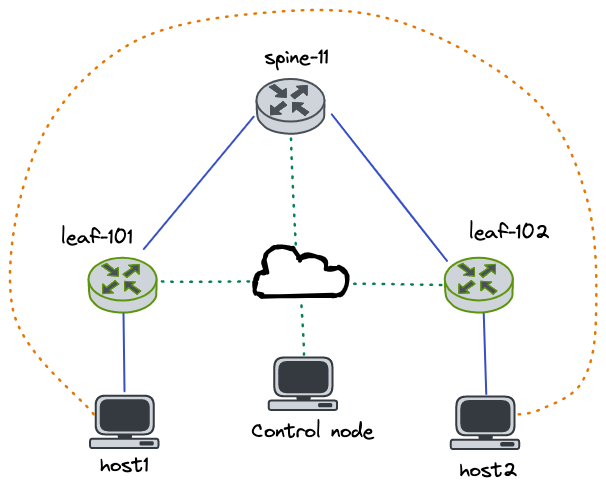

# Ansible 101 Automate Your Network



## Requirements

- Install Python and Ansible requirements

  ```shell
  git clone https://github.com/aristanetworks/netdevops-examples.git
  cd netdevops-examples/demo/ansible-101-may2022/
  sudo apt install python3.8-venv python3-pip -y # Modify for local version
  python3 -m venv venv
  source venv/bin/activate
  pip install wheel
  pip install -r requirements.txt
  ansible-galaxy collection install arista.eos
  ```

## Lab Environment

The lab included in this repository was deployed using Containerlab and cEOS nodes running on a simple Ubuntu 20.04 server. If you would like to use cEOS with Containerlab, please follow instructions below. If you would like to use another platform like EVE-NG or GNS3, those would work great as well. If management addresses or login credentials (admin/admin) are different, those changes would have to be updated in the respective files (inventory file/group_vars).

- Install Docker

  ```shell
  sudo apt update
  sudo apt install apt-transport-https ca-certificates curl software-properties-common
  curl -fsSL https://download.docker.com/linux/ubuntu/gpg | sudo apt-key add -
  sudo add-apt-repository "deb [arch=amd64] https://download.docker.com/linux/ubuntu focal stable"
  apt-cache policy docker-ce
  sudo apt install docker-ce
  sudo systemctl status docker
  ```

- Docker without Sudo

  ```shell
  sudo usermod -aG docker ${USER}
  su - ${USER}
  ```

- Install Containerlab

  ```shell
  # download and install the latest release (may require sudo)
  bash -c "$(curl -sL https://get.containerlab.dev)"
  ```

- Import cEOS Images (can be found [here](https://www.arista.com/en/support/software-download) with guest login)

  ```shell
  (venv) ➜  ~ ls
  cEOS-lab-4.27.4M.tar  cEOS-lab-4.28.0F.tar
  (venv) ➜  ~ docker import cEOS-lab-4.28.0F.tar ceos:4.28.0F
  ```

- Deploy Lab

  - If local cEOS versions are not the same as those described in `pyn.yml`, please update versions to reflect local lab
    ```yml
    # Example
    topology:
      kinds:
        ceos:
          image: ceos:4.28.0F
    ```

  ```shell
  (venv) ➜  ansible-101-may2022 git:(master) ✗ sudo containerlab deploy -t pyn.yml 
  INFO[0000] Containerlab v0.26.0 started                 
  INFO[0000] Parsing & checking topology file: pyn.yml    
  INFO[0000] Creating lab directory: /home/julio/repos/netdevops-examples/demo/ansible-101-may2022/clab-demo 
  INFO[0000] Creating docker network: Name="statics", IPv4Subnet="192.168.100.0/24", IPv6Subnet="", MTU="1500" 
  INFO[0000] Creating container: "host2"                  
  INFO[0000] Creating container: "host1"                  
  INFO[0000] Creating container: "leaf-102"               
  INFO[0000] Creating container: "leaf-101"               
  INFO[0000] Creating container: "spine-11"               
  INFO[0001] Creating virtual wire: leaf-102:eth1 <--> spine-11:eth2 
  INFO[0001] Creating virtual wire: leaf-102:eth3 <--> host2:eth1 
  INFO[0001] Creating virtual wire: leaf-101:eth1 <--> spine-11:eth1 
  INFO[0001] Creating virtual wire: leaf-101:eth3 <--> host1:eth1 
  INFO[0001] Running postdeploy actions for Arista cEOS 'spine-11' node 
  INFO[0001] Running postdeploy actions for Arista cEOS 'leaf-101' node 
  INFO[0001] Running postdeploy actions for Arista cEOS 'leaf-102' node 
  INFO[0093] Adding containerlab host entries to /etc/hosts file 
  +---+----------+--------------+--------------------------------------+-------+---------+-------------------+--------------+
  | # |   Name   | Container ID |                Image                 | Kind  |  State  |   IPv4 Address    | IPv6 Address |
  +---+----------+--------------+--------------------------------------+-------+---------+-------------------+--------------+
  | 1 | host1    | 83ee3134caf0 | wbitt/network-multitool:alpine-extra | linux | running | 192.168.100.31/24 | N/A          |
  | 2 | host2    | 1b0cb0b196aa | wbitt/network-multitool:alpine-extra | linux | running | 192.168.100.32/24 | N/A          |
  | 3 | leaf-101 | 8788cb85f86a | ceos:4.28.0F                         | ceos  | running | 192.168.100.11/24 | N/A          |
  | 4 | leaf-102 | 456339312b66 | ceos:4.27.4M                         | ceos  | running | 192.168.100.12/24 | N/A          |
  | 5 | spine-11 | 1bfcc83ded3b | ceos:4.28.0F                         | ceos  | running | 192.168.100.21/24 | N/A          |
  +---+----------+--------------+--------------------------------------+-------+---------+-------------------+--------------+
  (venv) ➜  ansible-101-may2022 git:(master) ✗ 
  ```

- Destroy Lab

  ```shell
  sudo containerlab destroy -t pyn.yml
  ```

## Arista AVD

If you would like to edit any of the group variables and start getting experience with AVD, installation of the AVD collection is required.

```shell
ansible-galaxy collection install arista.avd
```

Once that is complete, you can run `ansible-playbook fabric.yml` to recreate intended configurations.

## Execute Playbooks

At this point the local lab deployment is done and you can execute any playbooks in the playbooks directory. A simple bash script is included to save on typing. 

```shell
(venv) ➜  ansible-101-may2022 git:(master) ✗ ansible-playbook playbooks/3_backup.yml 
PLAY [Device backup]

TASK [Save configuration for EOS devices]
changed: [leaf-102]
changed: [spine-11]
changed: [leaf-101]

PLAY RECAP 
leaf-101                   : ok=1    changed=1    unreachable=0    failed=0    skipped=0    rescued=0    ignored=0   
leaf-102                   : ok=1    changed=1    unreachable=0    failed=0    skipped=0    rescued=0    ignored=0   
spine-11                   : ok=1    changed=1    unreachable=0    failed=0    skipped=0    rescued=0    ignored=0   

(venv) ➜  ansible-101-may2022 git:(master) ✗
```

```shell
(venv) ➜  ansible-101-may2022 git:(master) ✗ ./run.sh -n 3
ansible-playbook playbooks/3_backup.yml
PLAY [Device backup]

TASK [Save configuration for EOS devices]
ok: [leaf-102]
ok: [spine-11]
ok: [leaf-101]

PLAY RECAP
leaf-101                   : ok=1    changed=0    unreachable=0    failed=0    skipped=0    rescued=0    ignored=0   
leaf-102                   : ok=1    changed=0    unreachable=0    failed=0    skipped=0    rescued=0    ignored=0   
spine-11                   : ok=1    changed=0    unreachable=0    failed=0    skipped=0    rescued=0    ignored=0   

(venv) ➜  ansible-101-may2022 git:(master) ✗
```