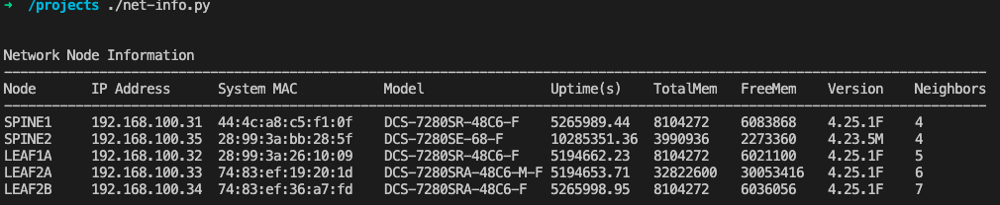
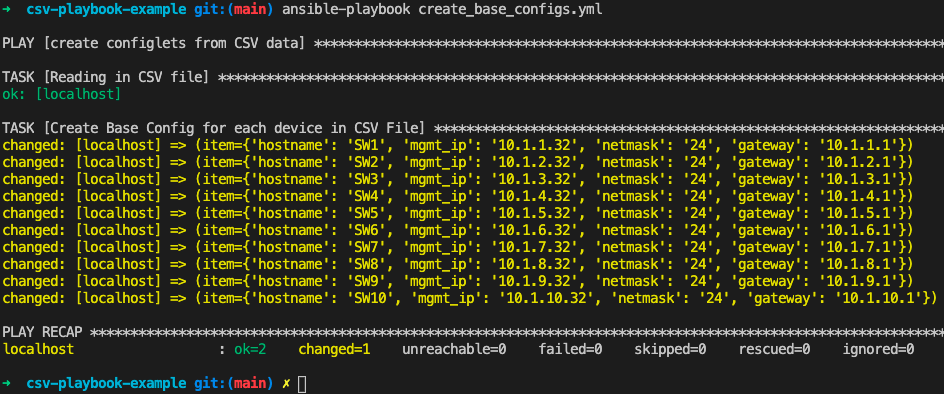

# Network Automation


## Getting Started Roadmap

Building your own automation workflow with open source tools doesn't have to be overly complicated.  Start by familiarizing yourself with these foundational elements:

- Linux
- Python
- Git

Next... setup your machine with the suggested tools below.

## Install these as part of your Automation Toolbox

- [Microsoft VSCode Editor](https://code.visualstudio.com/Download)
- [Git](https://git-scm.com/book/en/v2/Getting-Started-Installing-Git)
- [Ansible](https://docs.ansible.com/ansible/latest/installation_guide/intro_installation.html)
- [Python 3](https://www.python.org/downloads/)
- [Docker Desktop](https://www.docker.com/products/docker-desktop)

Once these tools are installed, take a look at the examples below and try them out!

## Example #1 - Python Script to gather Network Inventory from Arista Network switches

Quick example of using the Arista eAPI to gather information (hostname, uptime, mac-address, lldp neighbors, etc...) from a network of switches.

**Requirements:**  Git, Python2 or Python3 (preferred) installed and Arista switches that are reachable from your workstation.  You will need to modify the IP address list of switches in the script to match your environment.

Install the JSONRPCLIB module to allow eAPI connection to be built to the switch.

If you are running python2, install **jsonrpclib** module

```text
pip install jsonrpclib
```

If you are running python3, install **jsonrpclib-pelix** module

```text
pip3 install jsonrpclib-pelix
```

In this example, we have a running lab of 5 Arista switches available to query.  Modify the script with the EOS nodes in your network and update the username and password.

```text
cd python-example
./net-info.py
```

Output should look similar to the following:



## Example #2 - Ansible Playbook to Create Base Configs from a CSV File

The following playbook creates a unique base device configuration for each row in the CSV file.

| File/Directory | Description |
| -------- | -------- |
| **./playbooks/create_base_configs.yml** | Playbook |
| **./templates/base-cfg.j2** | Jinja Template |
| **./datafiles/devices.csv** | CSV File of Device with header row (used for variable names in Jinja) |
| **./base-configs/** | Directory for rendered configuration files |

Test it out: (*requires ansible to be installed*)

```text
cd csv-playbook-example
ansible-playbook create_base_configs.yml
```

Output should look similar to the following:



Look for config files inside the **./base-configs/** directory.

## Docker Image & Container Build

## Prerequisites

- Docker installed on local machine
- https://docs.docker.com/get-docker/

## STEP 1 - Change to 'docker' Directory

```shell
cd docker
```

## STEP 2 - Build Docker Image

```shell
docker build -f Dockerfile --tag mydevbox/base .
```

## STEP 3 - Run container and attach to local current directory

Launches Docker container mydevbox/base and attaches to your local current directory

MacOS

```shell
docker run -it --rm -v $(PWD):/workspace mydevbox/base
```

Windows

```shell
docker run -it --rm -v %cd%:/workspace mydevbox/base
```

## STEP 4 - Change into Directory 'workspace'

While in the container, change to directory 'workspace'.  The contents will be a pointer to your local directory the container was launched from.

```shell
cd workspace
ls -l
```

You know are running a full Ubuntu container with:

- Ubuntu 20.04.1
- Python 3.8.5
- Ansible 2.10.5
- Modules for Netbox & YAML with dependencies pre-installed

```text
pip list

Package      Version
------------ ---------
ansible      2.10.4
ansible-base 2.10.5
certifi      2020.12.5
cffi         1.14.4
chardet      4.0.0
cryptography 3.4.3
dbus-python  1.2.16
idna         2.10
Jinja2       2.11.3
MarkupSafe   1.1.1
netaddr      0.8.0
packaging    20.9
pip          20.0.2
pycparser    2.20
PyGObject    3.36.0
pynetbox     5.3.1
pyparsing    2.4.7
PyYAML       5.4.1
requests     2.25.1
setuptools   45.2.0
six          1.15.0
urllib3      1.26.3
wheel        0.34.2
```

For integrating your container with VSCode check out:

[Docker & VSCode Integration](https://code.visualstudio.com/docs/remote/containers)