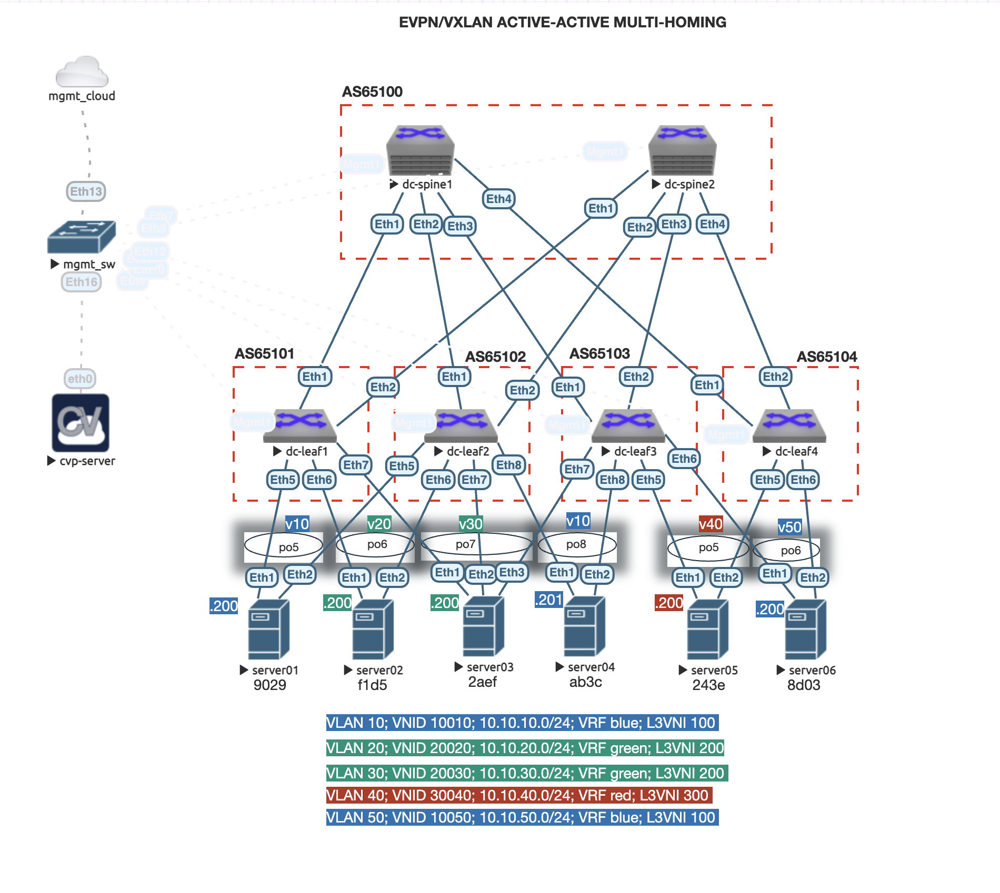
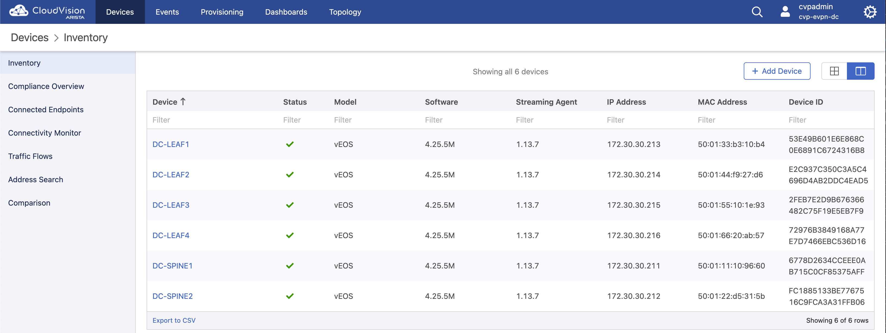
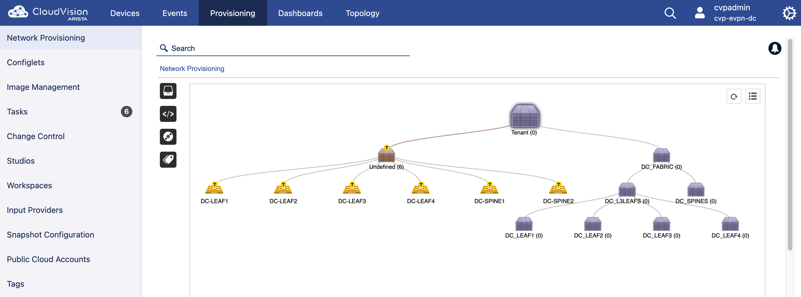
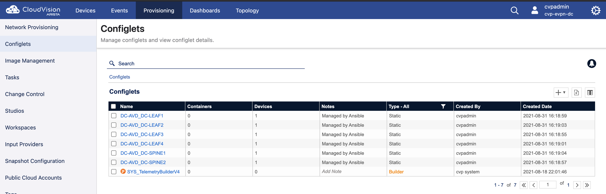
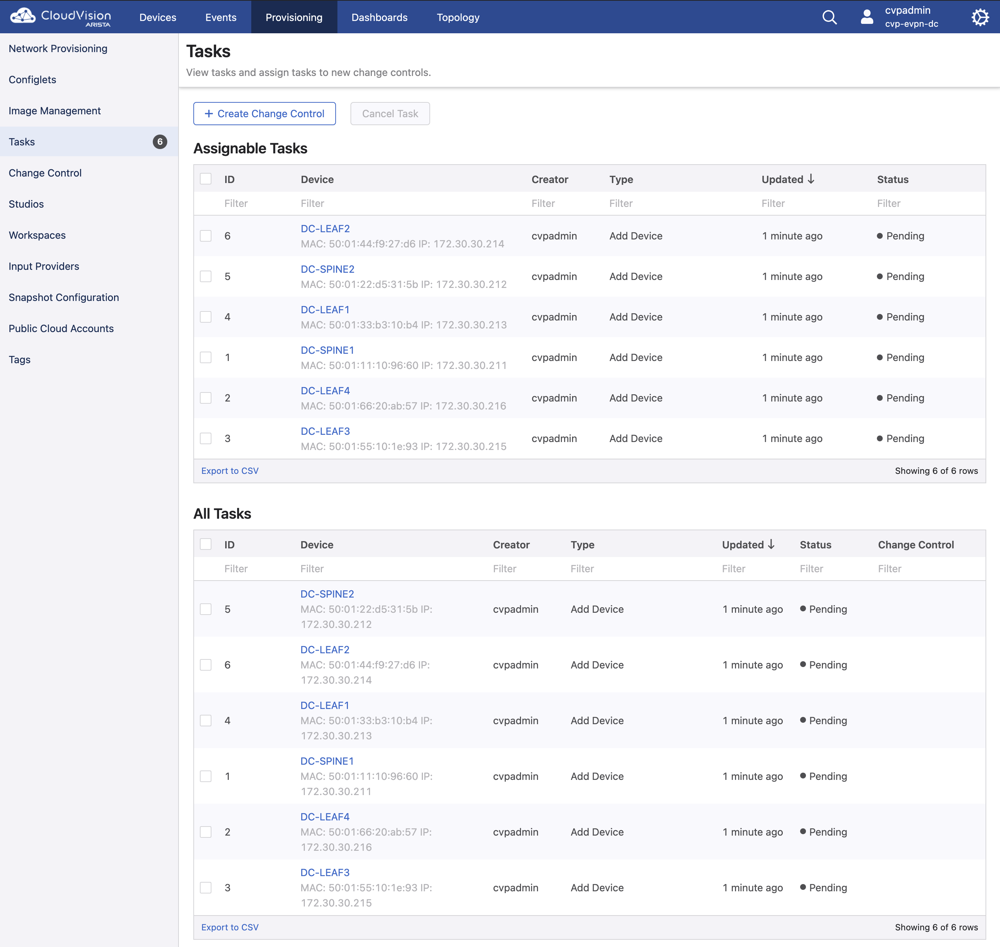

* [Introduction](#introduction)
  - [Requirements](#requirements)
  - [Environment setup](#environment-setup)
  - [Lab deployment](#lab-deployment)
  - [Lab validation](#lab-validation)
  - [Devices snapshot](#devices-snapshot)
  - [Manual validations](#manual-validations)
  - [Useful Links](#useful-links)

## **Introduction:**

This lab will demonstrate the deployment of an EVPN/VXLAN Active-Active (A-A) multihoming Spine/Leaf using CloudVision and Ansible AVD.

The topology created on EVE-NG is as shown below: 



Details on the fabric underlay and overlay infrastructure is located [here](./inventory/documentation/fabric/DC_FABRIC-documentation.md)

---

## **Requirements:**

For this lab environment the following tools and Arista images are used: 

### *Arista:*
- Arista vEOS-lab 4.25.5M
- Arista CloudVision Portal 2021.1.1

### *EVE-NG:*
- EVE-NG Professional Edition 4.0.1-56

### *Python:*
- Python 3.9.6 (min supported 3.6.8)

### *Ansible:*
- Ansible 2.10.13 (min supported 2.10.7)

### *Ansible roles:*
- arista.avd
- arista.cvp

### *Additional python libraries:*
- netaddr==0.7.19
- Jinja2==2.11.3
- treelib==1.5.5
- cvprac==1.0.5
- paramiko==2.7.1
- jsonschema==3.2.0
- requests==2.25.1
- PyYAML==5.4.1
- md-toc==7.1.0

### *Workstation:* 
- Any device Mac/Win/Linux or VM with network reachability to the CloudVision server and EOS management interfaces. 

### *DHCP Server:*
- Any DHCP server that can provide IP reservation based on MAC address. The DHCP server needs to be located on the same management network as the vEOS devices for the ZTP process. For this lab we used ISC-DHCP inside de CloudVision server (This is only for lab purposes and not recommended for prod environments).

---

## **Environment Setup:**

To run this lab, either clone this repo in your local environment and use ***/virtual_lab/EVE_NG/labs/EVPN_AA_Multihoming*** as your root folder or for a cleaner approach, create a new folder in your local environment (or docker AVD container - see next section). If you choose the later, create the following folder structure on the root folder and copy the file content from this repo: 

```
|--EVPN_AA_Multihoming
   |--ansible.cfg
   |--requirements.txt
   |--inventory
      |--inventory.yml
      |--group_vars
        |--CVP.yml
        |--DC.yml
        |--DC_FABRIC.yml
        |--DC_SPINES.yml
        |--DC_L3LEAFS.yml
        |--DC_SERVERS.yml
        |--DC_TENANTS_NETWORKS.yml
    |--playbooks
       |--cvp
          |--playbook_cvp_ztp_config.yml
          |--playbook_deploy_cvp.yml
          |--playbook_cvp_validate_states.yml
          |--playbook_cvp_device_snapshot.yml
```

Two methods can be used to get Ansible up and running: running a Python virtual envionrment or using the AVD docker container. 

### - AVD Docker container:
The AVD docker is a container with all requirements pre-installed. It is a quick way to start working on your lab without worrying about setting up your environment. 
Info about getting the AVD docker container up and running [here](https://avd.sh/en/releases-v3.x.x/docs/installation/setup-environment.html#use-docker-as-avd-shell)

### - Python virtual environment:
1. From the project root folder (*/EVPN_AA_Multihoming*) create a new python environment and activate it:

```bash
$ pwd
/home/user/EVPN_AA_Multihoming

$ python3 -m venv .venv
$ source .venv/bin/activate
```

2. Update pip and install requirements:

```bash
$ python3 -m pip install --upgrade pip
$ pip install -r requirements.txt
```

3. Install ansible AVD and CVP collections:

```bash
$ ansible-galaxy collection install arista.avd
$ ansible-galaxy collection install arista.cvp
```

4. Setup your EVE-NG topology as in the topology image. Alternatively, you can download the lab file and import to your EVE-NG server. [Arista_CVP_EVPN_AA_multihoming_lab.zip](./data/eve_lab_topology/Arista_CVP_EVPN_AA_multihoming_lab.zip) 

5. Start your CloudVision Portal (CVP) node on EVE-NG and do the initial setup (not covered in this lab).

6. Start your DHCP server and make sure to create static reservations using the management interface mac address of each node. Alternatively if you want to run the DHCP server in your CVP server, update the ***/inventory/group_vars/CVP.yml*** file with the proper mac addresses and run the ***playbook_cvp_ztp_config.yml*** playbook. 
Note: Step 5 must be completed to run this task. Also, you can modify the IPs to fit your networks requirements, if you do change the IP, remember to update the information on the *inventory.yml* file. 

```bash
$ nano /inventory/group_vars/CVP.yml
---
ztp:
  default:
    registration: 'https://172.30.30.252/ztp/bootstrap'
    gateway: 172.30.30.1
    nameservers:
      - '172.30.30.6'
      - '1.1.1.1'
  general:
    subnets:
      - network: 172.30.30.0
        netmask: 255.255.255.0
        gateway: 172.30.30.1
        nameservers:
          - '172.30.30.6'
          - '1.1.1.1'
        start: 172.30.30.200
        end: 172.30.30.210
        lease_time: 300
  clients:
  # AVD/CVP Integration
    - name: DC-SPINE1
      mac: '50:01:11:11:00:00'
      ip4: 172.30.30.211
    - name: DC-SPINE2
      mac: '50:01:22:22:00:00'
      ip4: 172.30.30.212
    - name: DC-LEAF1
      mac: '50:01:33:33:00:00'
      ip4: 172.30.30.213
    - name: DC-LEAF2
      mac: '50:01:44:44:00:00'
      ip4: 172.30.30.214
    - name: DC-LEAF3
      mac: '50:01:55:55:00:00'
      ip4: 172.30.30.215
    - name: DC-LEAF4
      mac: '50:01:66:66:00:00'
      ip4: 172.30.30.216

# After done editing the file, run the ZTP playbook. 
$ ansible-playbook playbook/cvp/playbook_cvp_ztp_config.yml
```
7. The server nodes connected to the leafs are not managed by Ansible and needs to be configured manually according to the topology. For simplicity, this lab uses Arista vEOS devices configured with port-channels. The running config for these devices can be located under ***/data/server_configs/serverXX.conf***. 

At this point, your environment should be ready to deploy and you can move to the next section. 

---

## **Lab Deployment:**

1. Turn on all the spine and leaf nodes. On the factory default mode they will boot on ZTP mode and will search for a DHCP server. Your DHCP server should assign an IP and direct the nodes to the CVP server. After finishing the boot process, all nodes should show up on your CVP server under the ***Device > Inventory*** tab.



2. Make sure to review the **inventory.yml** and files under **group_vars/**, you can update the files to fit your needs or leave the values as they are. Once you are confortable with the values, run the playbook to build all documentation and intended configuration files: 

```bash
$ ansible-playbook playbooks/cvp/playbook_cvp_deploy_cvp.yml --tags build
```

When passing the **"build"** tag, this playbook will create new folders and generate all the documentation and intended config files that will eventually be pushed to CVP as configlets. At this point, your project structure should have the following new folders:

```
|--EVPN_AA_Multihoming
   |--inventory
      |--config_backup
      |--documentation
        |--devices
        |--fabric
      |--intended
        |--configs
        |--structured_configs
      |--reports
      |--snapshots
```

The final spine/leaf configuration file is created under **/inventory/intended/configs/DC-XXXX.cfg**, you can review each config file and make sure the intended config is as expected. 

```cli
#sample intended config file for DC-LEAF1

$ cat /inventory/intended/configs/DC-LEAF1.cfg

!RANCID-CONTENT-TYPE: arista
!
daemon TerminAttr
   exec /usr/bin/TerminAttr -ingestgrpcurl=172.30.30.252:9910 -cvcompression=gzip -ingestauth=key,arista -smashexcludes=ale,flexCounter,hardware,kni,pulse,strata -ingestexclude=/Sysdb/cell/1/agent,/Sysdb/cell/2/agent -ingestvrf=mgmt -taillogs
   no shutdown
!
vlan internal order ascending range 1006 1199
!
transceiver qsfp default-mode 4x10G
!
service routing protocols model multi-agent
!
hostname DC-LEAF1
ip name-server vrf mgmt 1.1.1.1
ip name-server vrf mgmt 172.30.30.6
!
dns domain homelab.io
!
ntp local-interface vrf mgmt Management1
ntp server vrf mgmt time.google.com iburst prefer
!
spanning-tree mode mstp
spanning-tree mst 0 priority 4096
!
no aaa root
no enable password
!
clock timezone America/Toronto
!
vlan 10
   name Tenant_blue_compute
!
vlan 20
   name Tenant_green_compute
!
vlan 30
   name Tenant_green_storage
!
vrf instance mgmt
!
vrf instance Tenant_blue_vrf
!
vrf instance Tenant_green_vrf
!
... Full config file shortened for brevity ...
```

3. To create the configlets and push to the CVP server you need to run the previous playbook passing the **provision** tag.

```bash
$ ansible-playbook playbooks/cvp/playbook_cvp_deploy_cvp.yml --tags provision
```

This playbook has 3 main functions:

- Read the **inventory.yml** file and build the container structure



- Create configlets based on the intended config files



- Create the tasks on CVP to push the configlets to each node 



4. Final step is to go on CVP under **Provisioning > Tasks**, select all tasks created by ansible and execute all tasks. 

After executing the tasks on CVP, all nodes will reboot and once they come up, the topology should be up and running with full underlay/overlay connectivity. In the next steps, we will run some lab validations. 

---

## **Lab validation:**

AVD offers a role to validate all operational states of the Arista EOS devices. It connects to the devices and collects the actual states and generates a report (markdown and CSV) with the results. After finishing the lab deployment, use the **playbook_cvp_validate_states.yml** to run the automated tests.

```bash
$ ansible-playbook playbooks/cvp/playbook_cvp_validate_states.yml
```

After running the playbook, the reports can be located under the **/inventory/reports/** folder.

```bash
$ cat /inventory/reports/DC_FABRIC-state.md


# Validate State Report

**Table of Contents:**

- [Validate State Report](validate-state-report)
  - [Test Results Summary](#test-results-summary)
  - [Failed Test Results Summary](#failed-test-results-summary)
  - [All Test Results](#all-test-results)

## Test Results Summary

### Summary Totals

| Total Tests | Total Tests Passed | Total Tests Failed |
| ----------- | ------------------ | ------------------ |
| 215 | 215 | 0 |

### Summary Totals Devices Under Tests

| DUT | Total Tests | Tests Passed | Tests Failed | Categories Failed |
| --- | ----------- | ------------ | ------------ | ----------------- |
| DC-LEAF1 |  38 | 38 | 0 | - |
| DC-LEAF2 |  40 | 40 | 0 | - |
| DC-LEAF3 |  41 | 41 | 0 | - |
| DC-LEAF4 |  34 | 34 | 0 | - |
| DC-SPINE1 |  31 | 31 | 0 | - |
| DC-SPINE2 |  31 | 31 | 0 | - |

### Summary Totals Per Category

| Test Category | Total Tests | Tests Passed | Tests Failed |
| ------------- | ----------- | ------------ | ------------ |
| NTP |  6 | 6 | 0 |
| Interface State |  75 | 75 | 0 |
| LLDP Topology |  16 | 16 | 0 |
| IP Reachability |  16 | 16 | 0 |
| BGP |  38 | 38 | 0 |
| Routing Table |  40 | 40 | 0 |
| Loopback0 Reachability |  24 | 24 | 0 |

## Failed Test Results Summary

| Test ID | Node | Test Category | Test Description | Test | Test Result | Failure Reason |
| ------- | ---- | ------------- | ---------------- | ---- | ----------- | -------------- |

... Rest of file shortened for brevity ...
```

---

## **Devices Snapshot:**

Another AVD feature is automated device snapshot. The snapshot playbook collects the output from different "show" commands and generate a report with the information. Use the **playbook_cvp_device_snapshot.yml** to run and collect the devices snapshot.

```bash
$ ansible-playbook playbooks/cvp/playbook_cvp_device_snapshot.yml
```
After running the playbook, the snapshot reports can be located under the **/inventory/snapshots/** folder.

```bash

$ cat inventory/snapshots/DC-LEAF1/report.md

# DC-LEAF1 Commands Output

## Table of Contents

- [show lldp neighbors](#show-lldp-neighbors)
- [show ip interface brief](#show-ip-interface-brief)
- [show interfaces description](#show-interfaces-description)
- [show version](#show-version)
- [show running-config](#show-running-config)
## show interfaces description


Interface                      Status         Protocol           Description
Et1                            up             up                 P2P_LINK_TO_DC-SPINE1_Ethernet1
Et2                            up             up                 P2P_LINK_TO_DC-SPINE2_Ethernet1
Et3                            up             up                 
Et4                            up             up                 
Et5                            up             up                 server01_E1
Et6                            up             up                 server02_E1
Et7                            up             up                 server03_E1
Et8                            up             up                 
Et9                            up             up                 
Et10                           up             up                 
Et11                           up             up                 
Lo0                            up             up                 EVPN_Overlay_Peering
Lo1                            up             up                 VTEP_VXLAN_Tunnel_Source
Lo100                          up             up                 Tenant_blue_vrf_VTEP_DIAGNOSTICS
Lo200                          up             up                 Tenant_green_vrf_VTEP_DIAGNOSTICS
Ma1                            up             up                 oob_management
Po5                            up             up                 server01_PortChannel
Po6                            up             up                 server02_PortChannel
Po7                            up             up                 server03_PortChannel
Vl10                           up             up                 Tenant_blue_compute
Vl20                           up             up                 Tenant_green_compute
Vl30                           up             up                 Tenant_green_storage
Vl1197                         up             up                 
Vl1198                         up             up                 
Vl1199                         up             up                 
Vx1                            up             up

## show ip interface brief


Address 
Interface       IP Address           Status     Protocol         MTU    Owner   
--------------- -------------------- ---------- ------------ ---------- ------- 
Ethernet1       10.10.100.1/31       up         up              1500            
Ethernet2       10.10.100.3/31       up         up              1500            
Loopback0       192.168.100.3/32     up         up             65535            
Loopback1       192.168.101.3/32     up         up             65535            
Loopback100     10.255.1.3/32        up         up             65535            
Loopback200     10.255.2.3/32        up         up             65535            
Management1     172.30.30.213/24     up         up              1500            
Vlan10          10.10.10.1/24        up         up              1500            
Vlan20          10.10.20.1/24        up         up              1500            
Vlan30          10.10.30.1/24        up         up              1500            
Vlan1197        unassigned           up         up              9164            
Vlan1198        unassigned           up         up              9164            
Vlan1199        unassigned           up         up              9164

## show lldp neighbors


Last table change time   : 0:27:31 ago
Number of table inserts  : 6
Number of table deletes  : 0
Number of table drops    : 0
Number of table age-outs : 0

Port          Neighbor Device ID         Neighbor Port ID    TTL 
---------- -------------------------- ---------------------- --- 
Et1           DC-SPINE1.homelab.io       Ethernet1           120 
Et2           DC-SPINE2.homelab.io       Ethernet1           120 
Et5           server01                   Ethernet1           120 
Et6           server02                   Ethernet1           120 
Et7           server03                   Ethernet1           120 
Ma1           mgmt-sw                    Ethernet9           120


... Rest of file shortened for brevity ...
```

## **Manual Validations:**

To validate proper tenancy connectiviy we can do some basic ping test to make sure that proper reachability exist as defined on the **DC_TENANTS_NETWORKS.yml** file. First, lets take a look at the file:

```bash
$ cat /inventory/group_vars/DC_TENANTS_NETWORKS.yml

---
# DC Tenants Networks
# Documentation of Tenant specific information - Vlans/VRFs
tenants:
  # Tenant Blue Specific Information - VRFs / VLANs
  Tenant_blue:
    mac_vrf_vni_base: 10000
    vrfs:
      Tenant_blue_vrf:
        vrf_vni: 100
        vtep_diagnostic:
          loopback: 100
          loopback_ip_range: 10.255.1.0/24
        svis:
          10:
            name: Tenant_blue_compute
            tags: [blue_compute]
            enabled: true
            ip_address_virtual: 10.10.10.1/24
          50:
            name: Tenant_blue_storage
            tags: [blue_storage]
            enabled: true
            ip_address_virtual: 10.10.50.1/24

  # Tenant Green Specific Information - VRFs / VLANs
  Tenant_green:
    mac_vrf_vni_base: 20000
    vrfs:
      Tenant_green_vrf:
        vrf_vni: 200
        vtep_diagnostic:
          loopback: 200
          loopback_ip_range: 10.255.2.0/24
        svis:
          20:
            name: Tenant_green_compute
            tags: [green_compute]
            enabled: true
            ip_address_virtual: 10.10.20.1/24
          30:
            name: Tenant_green_storage
            tags: [green_storage]
            enabled: true
            ip_address_virtual: 10.10.30.1/24

  # Tenant Red Specific Information - VRFs / VLANs
  Tenant_red:
    mac_vrf_vni_base: 30000
    vrfs:
      Tenant_red_vrf:
        vrf_vni: 300
        svis:
          40:
            name: Tenant_red_storage
            tags: [red_storage]
            enabled: true
            ip_address_virtual: 10.10.40.1/24

```
According to our file, we created three tenants: tenant_blue, tenant_green and tenant_red. Each tenant is an independent network and there is no inter-tenancy communication in this example. 
Each tenant has a single VRF: tenant_blue_vrf, tenant_green_vrf and tenant_red_vrf. The SVIs belonging to each tenant's VRF should be able to communicate using the VXLAN Anycast IP address assigned to each SVI as their default gateway. For example, SVI 10 on tenant_blue_vrf uses 10.10.10.1 as they default gateway to reach SVI 50. 

Based on this information and looking at the topology diagram, server01 should be able to only ping server04 and server06. Server02 should be able to only ping server03. And server05 is not able to ping any other network. 

```bash
#testing connectivity from server01

server01#ping 10.10.10.201
PING 10.10.10.201 (10.10.10.201) 72(100) bytes of data.
80 bytes from 10.10.10.201: icmp_seq=1 ttl=64 time=141 ms
80 bytes from 10.10.10.201: icmp_seq=2 ttl=64 time=130 ms
80 bytes from 10.10.10.201: icmp_seq=3 ttl=64 time=124 ms
80 bytes from 10.10.10.201: icmp_seq=4 ttl=64 time=117 ms
80 bytes from 10.10.10.201: icmp_seq=5 ttl=64 time=114 ms
--- 10.10.10.201 ping statistics ---
5 packets transmitted, 5 received, 0% packet loss, time 44ms
rtt min/avg/max/mdev = 114.536/125.629/141.416/9.593 ms, pipe 5, ipg/ewma 11.164/132.882 ms

server01#ping 10.10.50.200
PING 10.10.50.200 (10.10.50.200) 72(100) bytes of data.
80 bytes from 10.10.50.200: icmp_seq=1 ttl=62 time=67.4 ms
80 bytes from 10.10.50.200: icmp_seq=2 ttl=62 time=58.2 ms
80 bytes from 10.10.50.200: icmp_seq=3 ttl=62 time=53.3 ms
80 bytes from 10.10.50.200: icmp_seq=4 ttl=62 time=45.6 ms
80 bytes from 10.10.50.200: icmp_seq=5 ttl=62 time=39.3 ms
--- 10.10.50.200 ping statistics ---
5 packets transmitted, 5 received, 0% packet loss, time 42ms
rtt min/avg/max/mdev = 39.311/52.789/67.430/9.769 ms, pipe 5, ipg/ewma 10.702/59.413 ms

erver01#ping 10.10.20.200
PING 10.10.20.200 (10.10.20.200) 72(100) bytes of data.
From 10.10.10.1 icmp_seq=1 Destination Net Unreachable
--- 10.10.20.200 ping statistics ---
5 packets transmitted, 0 received, +1 errors, 100% packet loss, time 46ms

server01#ping 10.10.40.200
PING 10.10.40.200 (10.10.40.200) 72(100) bytes of data.
From 10.10.10.1 icmp_seq=1 Destination Net Unreachable
--- 10.10.40.200 ping statistics ---
5 packets transmitted, 0 received, +1 errors, 100% packet loss, time 55ms

#testing connectivity from server02

server02#ping 10.10.30.200
PING 10.10.30.200 (10.10.30.200) 72(100) bytes of data.
80 bytes from 10.10.30.200: icmp_seq=1 ttl=63 time=60.8 ms
80 bytes from 10.10.30.200: icmp_seq=2 ttl=63 time=50.2 ms
80 bytes from 10.10.30.200: icmp_seq=3 ttl=63 time=44.5 ms
80 bytes from 10.10.30.200: icmp_seq=4 ttl=63 time=38.4 ms
80 bytes from 10.10.30.200: icmp_seq=5 ttl=63 time=31.8 ms
--- 10.10.30.200 ping statistics ---
5 packets transmitted, 5 received, 0% packet loss, time 44ms
rtt min/avg/max/mdev = 31.850/45.199/60.880/9.969 ms, pipe 5, ipg/ewma 11.164/52.345 ms

server02#ping 10.10.10.200
PING 10.10.10.200 (10.10.10.200) 72(100) bytes of data.
From 10.10.20.1 icmp_seq=1 Destination Net Unreachable
--- 10.10.10.200 ping statistics ---
5 packets transmitted, 0 received, +1 errors, 100% packet loss, time 44ms

server02#ping 10.10.40.200
PING 10.10.40.200 (10.10.40.200) 72(100) bytes of data.
From 10.10.20.1 icmp_seq=1 Destination Net Unreachable
--- 10.10.40.200 ping statistics ---
5 packets transmitted, 0 received, +1 errors, 100% packet loss, time 45ms

server02#ping 10.10.50.200
PING 10.10.50.200 (10.10.50.200) 72(100) bytes of data.
From 10.10.20.1 icmp_seq=1 Destination Net Unreachable
--- 10.10.50.200 ping statistics ---
5 packets transmitted, 0 received, +1 errors, 100% packet loss, time 43ms

#testing connectivity from server05

server05#ping 10.10.10.200
PING 10.10.10.200 (10.10.10.200) 72(100) bytes of data.
From 10.10.40.1 icmp_seq=1 Destination Net Unreachable
--- 10.10.10.200 ping statistics ---
5 packets transmitted, 0 received, +1 errors, 100% packet loss, time 52ms

server05#ping 10.10.20.200
PING 10.10.20.200 (10.10.20.200) 72(100) bytes of data.
From 10.10.40.1 icmp_seq=1 Destination Net Unreachable
--- 10.10.20.200 ping statistics ---
5 packets transmitted, 0 received, +1 errors, 100% packet loss, time 41ms

server05#ping 10.10.30.200
PING 10.10.30.200 (10.10.30.200) 72(100) bytes of data.
From 10.10.40.1 icmp_seq=1 Destination Net Unreachable
--- 10.10.30.200 ping statistics ---
5 packets transmitted, 0 received, +1 errors, 100% packet loss, time 42ms

server05#ping 10.10.50.200
PING 10.10.50.200 (10.10.50.200) 72(100) bytes of data.
From 10.10.40.1 icmp_seq=1 Destination Net Unreachable
--- 10.10.50.200 ping statistics ---
5 packets transmitted, 0 received, +1 errors, 100% packet loss, time 52ms

```

If we want to validate proper distribution of ethernet-segment routes (type-4) across the EVPN fabric, we can do so with the following command:

```bash
#show type-4 routers learned for ESI 0000:0000:0001:1010:1010 from DC-LEAF1

DC-LEAF1#show bgp evpn route-type ethernet-segment esi 0000:0000:0001:1010:1010
BGP routing table information for VRF default
Router identifier 192.168.100.3, local AS number 65101
Route status codes: s - suppressed, * - valid, > - active, E - ECMP head, e - ECMP
                    S - Stale, c - Contributing to ECMP, b - backup
                    % - Pending BGP convergence
Origin codes: i - IGP, e - EGP, ? - incomplete
AS Path Attributes: Or-ID - Originator ID, C-LST - Cluster List, LL Nexthop - Link Local Nexthop

          Network                Next Hop              Metric  LocPref Weight  Path
 * >     RD: 192.168.101.3:1 ethernet-segment 0000:0000:0001:1010:1010 192.168.101.3
                                 -                     -       -       0       i
 * >Ec   RD: 192.168.101.4:1 ethernet-segment 0000:0000:0001:1010:1010 192.168.101.4
                                 192.168.101.4         -       100     0       65100 65102 i
 *  ec   RD: 192.168.101.4:1 ethernet-segment 0000:0000:0001:1010:1010 192.168.101.4
                                 192.168.101.4         -       100     0       65100 65102 i

```

To get more information about an especificif EVPN instance and the Designated forwarder (DF) you can do so with the following command:

```bash
DC-LEAF1#show bgp evpn instance vlan 10
EVPN instance: VLAN 10
  Route distinguisher: 192.168.100.3:10010
  Route target import: Route-Target-AS:10010:10010
  Route target export: Route-Target-AS:10010:10010
  Service interface: VLAN-based
  Local IP address: 192.168.101.3
  Encapsulation type: VXLAN
  Local ethernet segment:
    ESI: 0000:0000:0001:1010:1010
      Interface: Port-Channel5
      Mode: all-active
      State: up
      ES-Import RT: 00:01:10:10:10:10
      Designated forwarder: 192.168.101.3
      Non-Designated forwarder: 192.168.101.4

```
Based on the previous output, the DS for the SVI 10 for tenant_blue is 192.168.101.3 (DC-LEAF1). We can validate that by running a ping test on server01 and performing a packet capture on the upstream interface on DC-LEAF1 (eth5):

```bash
#ping from server01 to server06
server01#ping 10.10.50.200 interval 1 repeat 1000
PING 10.10.50.200 (10.10.50.200) 72(100) bytes of data.
80 bytes from 10.10.50.200: icmp_seq=1 ttl=62 time=55.6 ms
80 bytes from 10.10.50.200: icmp_seq=2 ttl=62 time=46.1 ms
80 bytes from 10.10.50.200: icmp_seq=3 ttl=62 time=39.5 ms
80 bytes from 10.10.50.200: icmp_seq=4 ttl=62 time=35.2 ms
80 bytes from 10.10.50.200: icmp_seq=5 ttl=62 time=44.2 ms
80 bytes from 10.10.50.200: icmp_seq=6 ttl=62 time=55.7 ms
^C
--- 10.10.50.200 ping statistics ---
6 packets transmitted, 6 received, 0% packet loss, time 5006ms
rtt min/avg/max/mdev = 35.277/46.118/55.721/7.616 ms

#packet capture on DC-LEAF1 
DC-LEAF1#tcpdump interface vlan 10 filter icmp
tcpdump: verbose output suppressed, use -v or -vv for full protocol decode
listening on vlan10, link-type EN10MB (Ethernet), capture size 262144 bytes
10:24:36.749611 50:01:10:5d:e6:c3 > 50:01:33:b3:10:b4, ethertype IPv4 (0x0800), length 114: 10.10.10.200 > 10.10.50.200: ICMP echo request, id 4835, seq 3, length 80
10:24:36.775214 50:01:33:b3:10:b4 > 50:01:10:5d:e6:c3, ethertype IPv4 (0x0800), length 114: 10.10.50.200 > 10.10.10.200: ICMP echo reply, id 4835, seq 3, length 80
10:24:37.750107 50:01:10:5d:e6:c3 > 50:01:33:b3:10:b4, ethertype IPv4 (0x0800), length 114: 10.10.10.200 > 10.10.50.200: ICMP echo request, id 4835, seq 4, length 80
10:24:37.773559 50:01:33:b3:10:b4 > 50:01:10:5d:e6:c3, ethertype IPv4 (0x0800), length 114: 10.10.50.200 > 10.10.10.200: ICMP echo reply, id 4835, seq 4, length 80
10:24:38.751177 50:01:10:5d:e6:c3 > 50:01:33:b3:10:b4, ethertype IPv4 (0x0800), length 114: 10.10.10.200 > 10.10.50.200: ICMP echo request, id 4835, seq 5, length 80
10:24:38.781538 50:01:33:b3:10:b4 > 50:01:10:5d:e6:c3, ethertype IPv4 (0x0800), length 114: 10.10.50.200 > 10.10.10.200: ICMP echo reply, id 4835, seq 5, length 80
10:24:39.760340 50:01:10:5d:e6:c3 > 50:01:33:b3:10:b4, ethertype IPv4 (0x0800), length 114: 10.10.10.200 > 10.10.50.200: ICMP echo request, id 4835, seq 6, length 80
10:24:39.796666 50:01:33:b3:10:b4 > 50:01:10:5d:e6:c3, ethertype IPv4 (0x0800), length 114: 10.10.50.200 > 10.10.10.200: ICMP echo reply, id 4835, seq 6, length 80
^C
8 packets captured

```
To validate proper failover, lets shutdown DC-LEAF1 interface eth5 and run a packet capture on DC-LEAF2 to make sure packets are now going towards the second link.

```bash
#repeat ping from server01 to server06
server01#ping 10.10.50.200 interval 1 repeat 1000
PING 10.10.50.200 (10.10.50.200) 72(100) bytes of data.
80 bytes from 10.10.50.200: icmp_seq=1 ttl=62 time=77.3 ms
80 bytes from 10.10.50.200: icmp_seq=2 ttl=62 time=37.9 ms
80 bytes from 10.10.50.200: icmp_seq=3 ttl=62 time=41.6 ms
80 bytes from 10.10.50.200: icmp_seq=4 ttl=62 time=38.1 ms
80 bytes from 10.10.50.200: icmp_seq=5 ttl=62 time=33.4 ms
80 bytes from 10.10.50.200: icmp_seq=6 ttl=62 time=37.5 ms
80 bytes from 10.10.50.200: icmp_seq=7 ttl=62 time=32.6 ms
80 bytes from 10.10.50.200: icmp_seq=8 ttl=62 time=35.8 ms
80 bytes from 10.10.50.200: icmp_seq=9 ttl=62 time=39.2 ms
^C
--- 10.10.50.200 ping statistics ---
9 packets transmitted, 9 received, 0% packet loss, time 8013ms
rtt min/avg/max/mdev = 32.630/41.542/77.374/12.938 ms

#start packet capture on DC-LEAF2
DC-LEAF2#tcpdump interface vlan 10 filter icmp
tcpdump: verbose output suppressed, use -v or -vv for full protocol decode
listening on vlan10, link-type EN10MB (Ethernet), capture size 262144 bytes

#shutdown interface eth5 on DC-LEAF1 
DC-LEAF1#conf t
DC-LEAF1(config)#int et5
DC-LEAF1(config-if-Et5)#shut

#Validate packet capture on DC-LEAF2
DC-LEAF2#tcpdump interface vlan 10 filter icmp
tcpdump: verbose output suppressed, use -v or -vv for full protocol decode
listening on vlan10, link-type EN10MB (Ethernet), capture size 262144 bytes
10:28:49.723934 50:01:10:5d:e6:c3 > 50:01:44:f9:27:d6, ethertype IPv4 (0x0800), length 114: 10.10.10.200 > 10.10.50.200: ICMP echo request, id 4908, seq 13, length 80
10:28:49.760233 50:01:44:f9:27:d6 > 50:01:10:5d:e6:c3, ethertype IPv4 (0x0800), length 114: 10.10.50.200 > 10.10.10.200: ICMP echo reply, id 4908, seq 13, length 80
10:28:50.725494 50:01:10:5d:e6:c3 > 50:01:44:f9:27:d6, ethertype IPv4 (0x0800), length 114: 10.10.10.200 > 10.10.50.200: ICMP echo request, id 4908, seq 14, length 80
10:28:50.752929 50:01:44:f9:27:d6 > 50:01:10:5d:e6:c3, ethertype IPv4 (0x0800), length 114: 10.10.50.200 > 10.10.10.200: ICMP echo reply, id 4908, seq 14, length 80
10:28:51.726120 50:01:10:5d:e6:c3 > 50:01:44:f9:27:d6, ethertype IPv4 (0x0800), length 114: 10.10.10.200 > 10.10.50.200: ICMP echo request, id 4908, seq 15, length 80
10:28:51.754481 50:01:44:f9:27:d6 > 50:01:10:5d:e6:c3, ethertype IPv4 (0x0800), length 114: 10.10.50.200 > 10.10.10.200: ICMP echo reply, id 4908, seq 15, length 80
10:28:52.726769 50:01:10:5d:e6:c3 > 50:01:44:f9:27:d6, ethertype IPv4 (0x0800), length 114: 10.10.10.200 > 10.10.50.200: ICMP echo request, id 4908, seq 16, length 80
10:28:52.751995 50:01:44:f9:27:d6 > 50:01:10:5d:e6:c3, ethertype IPv4 (0x0800), length 114: 10.10.50.200 > 10.10.10.200: ICMP echo reply, id 4908, seq 16, length 80
10:28:53.728883 50:01:10:5d:e6:c3 > 50:01:44:f9:27:d6, ethertype IPv4 (0x0800), length 114: 10.10.10.200 > 10.10.50.200: ICMP echo request, id 4908, seq 17, length 80
10:28:53.753404 50:01:44:f9:27:d6 > 50:01:10:5d:e6:c3, ethertype IPv4 (0x0800), length 114: 10.10.50.200 > 10.10.10.200: ICMP echo reply, id 4908, seq 17, length 80
```

As you can see, traffic was able to proper failover to the redundant link at DC-LEAF2 with no ping loss. 


## **Useful links:**

- [Ansible Collection for Arista Validated Designs](https://avd.sh/)
- [Ansible Modules for Arista CloudVision Platform](https://cvp.avd.sh/)
- [Arista EOS Central: Setting up EVE-NG, CloudVision Portal and vEOS (Login required)](https://eos.arista.com/setting-up-eve-ng-cloudvision-portal-and-veos/)
- [Ansible AVD CloudVision demo](https://github.com/arista-netdevops-community/ansible-avd-cloudvision-demo)
- [RFC7432 - BGP MPLS-Based Ethernet VPN](https://datatracker.ietf.org/doc/html/rfc7432)
- [Arista Design and Deployment Guides - Deploying EVPN Multihoming in Data Center Networks](https://www.arista.com/en/solutions/design-guides)