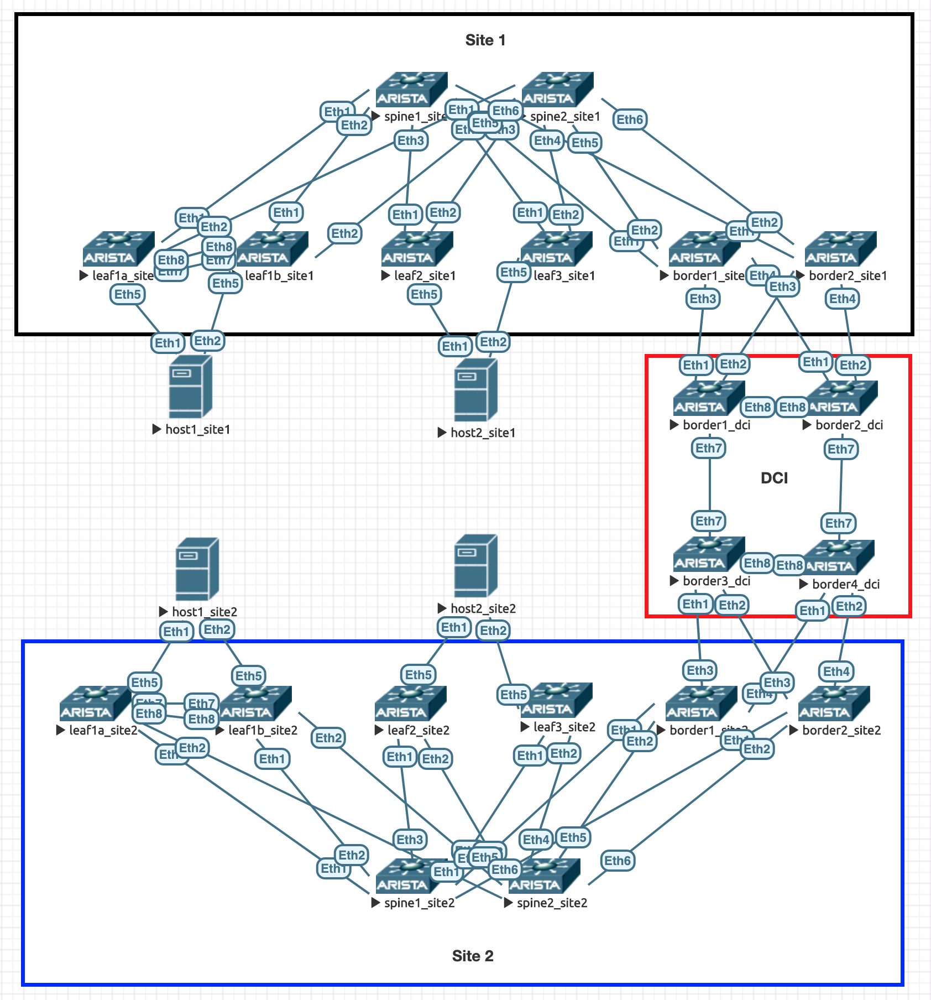

# Layer 3 Leaf-Spine Fabric

## Description
This virtual lab provides a full Layer 3 Leaf-Spine fabric in a 2 datacenter setup with VXLAN/EVPN. For optimization Layer 2 VNIs (Type 1 to 4) are not spread across datacenter border leafs and rather only EVPN Type-5 prefixes are exchanged. The underlay is completely built with BGP unnumbered.

Reachability between the sites is only given via L3 EVPN routing (eg. `192.168.101.0/24 <> 192.168.111.0/24`), but not inside the same L2 broadcast domain (VNI isolation).

## Topology

## Features used

### Underlay

* IPv6 LLA
* BGP (in data center)
* MLAG

### Overlay

* VXLAN
  * Single attached behind MLAG
  * MLAG
  * Multi-homing A-A
* EVPN
  * Layer 2
  * Layer 3 (S-IRB)
  * Multi-homing A-A
* Route Filtering based on Route Target

## Image

* vEOS-Lab 4.24.0F [https://www.arista.com/en/support/software-download]

## Addressing scheme

### Loopback

#### Site 1

| Device  | ASN      | Loopback 0 (EVPN) | Loopback 1 (VTEP)                        |
|---------|----------|-------------------|------------------------------------------|
| spine1  | 65100    | 10.255.0.101/32   | n/a                                      |
| spine2  | 65100    | 10.255.0.102/32   | n/a                                      |
| leaf1a  | 65100.1  | 10.255.0.111/32   | 10.255.1.110/32 10.255.1.111/32 (sec) |
| leaf1b  | 65100.1  | 10.255.0.112/32   | 10.255.1.110/32 10.255.1.112/32 (sec) |
| leaf2   | 65100.2  | 10.255.0.113/32   | 10.255.1.113/32                          |
| leaf3   | 65100.3  | 10.255.0.114/32   | 10.255.1.114/32                          |
| border1 | 65100.51 | 10.255.0.151/32   | 10.255.1.151/32                          |
| border2 | 65100.52 | 10.255.0.152/32   | 10.255.1.151/32                          |

#### Site 2

| Device  | ASN      | Loopback 0 (EVPN) | Loopback 1 (VTEP)                        |
|---------|----------|-------------------|------------------------------------------|
| spine1  | 65200    | 10.255.0.201/32   | n/a                                      |
| spine2  | 65200    | 10.255.0.202/32   | n/a                                      |
| leaf1a  | 65200.1  | 10.255.0.211/32   | 10.255.1.210/32 10.255.1.211/32 (sec) |
| leaf1b  | 65200.1  | 10.255.0.212/32   | 10.255.1.210/32 10.255.1.212/32 (sec) |
| leaf2   | 65200.2  | 10.255.0.213/32   | 10.255.1.213/32                          |
| leaf3   | 65200.3  | 10.255.0.214/32   | 10.255.1.214/32                          |
| border1 | 65200.51 | 10.255.0.251/32   | 10.255.1.251/32                          |
| border2 | 65200.52 | 10.255.0.252/32   | 10.255.1.252/32                          |

#### DCI

| Device  | ASN      | Loopback 0 (EVPN) | Loopback 1 (VTEP)                        |
|---------|----------|-------------------|------------------------------------------|
| border1 | 65000    | 10.255.0.11/32    | n/a                                      |
| border2 | 65000    | 10.255.0.12/32    | n/a                                      |
| border3 | 65000    | 10.255.0.13/32    | n/a                                      |
| border4 | 65000    | 10.255.0.14/32    | n/a                                      |

### EVPN L2 VPN Tenant Configuration

| VLAN | RT      | MAC VNI | Tenant   |
|------|---------|---------|----------|
| 100  | 100:100 | 100     | n/a      |
| 101  | 100:100 | 101     | Tenant-A |
| 200  | 200:200 | 200     | n/a      |
| 201  | 200:100 | 201     | Tenant-B |

### EVPN L3 VPN Tenant Configuration

| VRF      | RT        | IP VNI | Site 1           | Site 2           |
|----------|-----------|--------|------------------|------------------|
| Tenant-A | 1000:1000 | 1000   | 192.168.101.0/24 | 192.168.111.0/24 |
| Tenant-B | 2000:2000 | 2000   | 192.168.201.0/24 | 192.168.211.0/24 |

### Host addressing

#### Site 2

| Host  | Interface | IP address        | VRF          |
|-------|-----------|-------------------|--------------|
| host1 | Po1.100   | 192.168.100.11/24 | Tenant-A-100 |
| host1 | Po1.101   | 192.168.101.11/24 | Tenant-A-101 |
| host1 | Po1.200   | 192.168.200.11/24 | Tenant-B-200 |
| host1 | Po1.201   | 192.168.201.11/24 | Tenant-B-201 |
| host2 | Po1.100   | 192.168.100.12/24 | Tenant-A-100 |
| host2 | Po1.101   | 192.168.101.12/24 | Tenant-A-101 |
| host2 | Po1.200   | 192.168.200.12/24 | Tenant-B-200 |
| host2 | Po1.201   | 192.168.201.12/24 | Tenant-B-201 |

#### Site 2

| Host  | Interface | IP address        | VRF          |
|-------|-----------|-------------------|--------------|
| host1 | Po1.100   | 192.168.100.13/24 | Tenant-A-100 |
| host1 | Po1.101   | 192.168.111.13/24 | Tenant-A-101 |
| host1 | Po1.200   | 192.168.200.13/24 | Tenant-B-200 |
| host1 | Po1.201   | 192.168.211.13/24 | Tenant-B-201 |
| host2 | Po1.100   | 192.168.100.14/24 | Tenant-A-100 |
| host2 | Po1.101   | 192.168.111.14/24 | Tenant-A-101 |
| host2 | Po1.200   | 192.168.200.14/24 | Tenant-B-200 |
| host2 | Po1.201   | 192.168.211.14/24 | Tenant-B-201 |